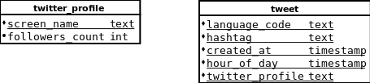
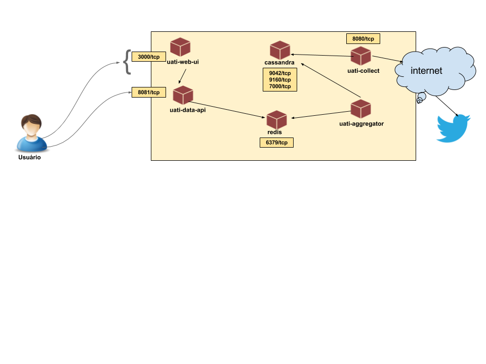

# Relatório Técnico

O projeto foi concluído com algumas divergências do plano de trabalho proposto nos seguintes itens:

- Não foram feitos testes automatizados
- Perdeu-se bastante tempo para ajustar a imagem docker para subir vários processo, pois [não é uma boa prática em sua utilização](https://docs.docker.com/engine/userguide/eng-image/dockerfile_best-practices/#/run-only-one-process-per-container)
- Perdeu-se bantante tempo entendendo o banco de dados Cassandra e Spark Hadoop pois não sabia nada sobre as tecnologias
- Foi adicionado a tecnologia de cache Redis não prevista, mas que atendeu muito bem para o tempo de resposta

# Modelo de dados



Usei bastante do tempo para aprender sobre o banco de dados Cassandra e o Spark.

# Diagrama de arquitetura



Fluxo:

- 1) Um script shell dispara requisições para a aplicação `uati-collect` para coletar as hashtags do problema
- 2) A aplicação `uati-collect` acesso o `Twitter` e coleta os dados solicitados
- 2.1) Salva as informações coletadas e salva no banco de dados `Cassandra`
- 3) Logo após é disparada uma solicitação para a aplicação `uati-aggregator` para agregar os dados coletados
- 3.1) Salva as informações agregadas no cacha `Redis`
- 4) O usuário tem acesso a aplicação `uati-web-ui` para visualizar os dados
- 5) A aplicação `uati-web-ui` acessa a aplicação `uati-data-api` para construir seus gráficos
- 6) A aplicação `uati-data-api` acessa o cache `Redis` para atentar as requisições da aplicação que solicitou os dados

# As aplicações

Para entender um pouco melhor sobre o que cara uma das aplicações faz, quais suas tecnologias e formas de construção acesse:

- [uati-aggregator](uati-aggregator/README.md)
- [uati-collector](uati-collector/README.md)
- [uati-data-api](uati-data-api/README.md)
- [uati-web-ui](uati-web-ui/README.md)
- [Cassandra](docker/Cassandra.md)
- [Redis](docker/Redis.md)

# Executando a aplicação

```
# Irá inicializar o container
docker run --rm -p 8081:8081 -p 3000:3000 netoht/uati:latest
```

Acesse a URL http://localhost:3000

O site é atualizado de 30 em 30 segundos.

# Referências:

- https://academy.datastax.com/resources/getting-started-apache-spark-and-cassandra
- https://spark-packages.org/package/datastax/spark-cassandra-connector
- https://github.com/datastax/spark-cassandra-connector
- https://www.tutorialspoint.com/cassandra/cassandra_quick_guide.htm
- https://www.infoq.com/br/articles/apache-spark-sql
- http://www.datastax.com/dev/blog/accessing-cassandra-from-spark-in-java
- http://www.ebaytechblog.com/2012/07/16/cassandra-data-modeling-best-practices-part-1/
- https://www.ibm.com/developerworks/br/library/os-apache-cassandra/
- https://docs.datastax.com/en/cql/3.1/cql/cql_using/useColumnsSort.html
- https://codurance.com/2016/04/17/sorted-pagination-in-cassandra/
- https://docs.datastax.com/en/cql/3.1/cql/cql_reference/batch_r.html
- https://docs.datastax.com/en/cql/3.3/cql/cql_using/useBatch.html
- http://www.datastax.com/2015/03/how-to-do-joins-in-apache-cassandra-and-datastax-enterprise
- https://docs.datastax.com/en/datastax_enterprise/4.6/datastax_enterprise/spark/sparkSqlJava.html
- https://www.tutorialspoint.com/spark_sql/programmatically_specifying_schema.htm
- http://spark.apache.org/docs/latest/sql-programming-guide.html
- https://dzone.com/articles/spark-sql-against-cassandra
